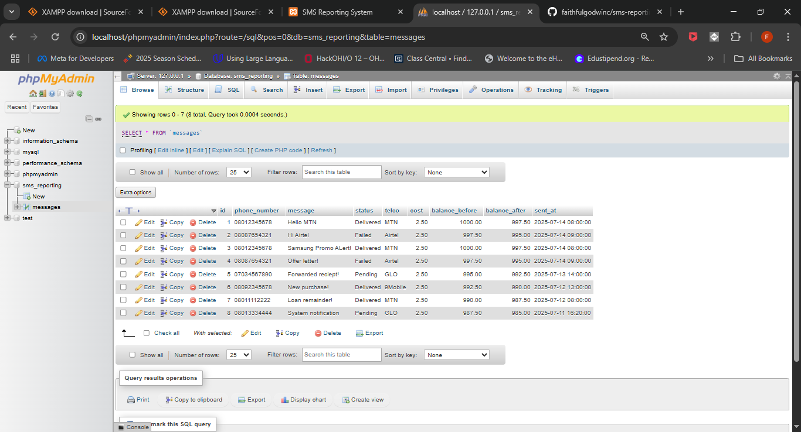
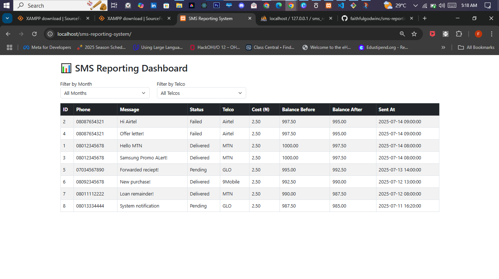

# 📊 SMS Reporting System

A simple web-based reporting system for a Bulk SMS service.  
> ⚠️ This system is for viewing SMS reports only — it does **not** send SMS messages.

---

## 🚀 Features

- 📈 **Delivery Reports**: View status of messages (Delivered, Failed, Pending)
- 💰 **Billing Reports**: View cost per message and balance before/after sending
- 📊 **Aggregated Reports**:
  - Total messages sent (daily, weekly, monthly)
  - Grouped billing summary per Telco (MTN, Airtel, GLO, 9Mobile)

---

## 🧰 Tech Stack

| Layer      | Tech Used           |
|------------|---------------------|
| Frontend   | HTML, Bootstrap, JavaScript |
| Backend    | PHP (basic)         |
| Database   | MySQL (via XAMPP)   |

---

## 📂 Folder Structure

sms-reporting-system/
│
├── index.html # Frontend UI
├── get_reports.php # PHP backend to fetch report data
├── config.php # Database connection (optional)
├── db/
│ └── sms_reporting.sql # SQL schema & dummy data (optional)
├── .gitignore
└── README.md

## SQL

## ⚙️ Setup Instructions (Local Development)

### 1. Prerequisites
- [VS Code](https://code.visualstudio.com/)
- [XAMPP](https://www.apachefriends.org/index.html) (includes Apache, MySQL, and phpMyAdmin)

### 2. Start Services
1. Open **XAMPP Control Panel**
2. Start **Apache** and **MySQL**

### 3. Create the Database
1. Go to `http://localhost/phpmyadmin`
2. Click **New**, create a database named `sms_reporting`
3. Run the SQL below to create the table:

```sql
CREATE TABLE messages (
  id INT AUTO_INCREMENT PRIMARY KEY,
  phone_number VARCHAR(20),
  message TEXT,
  status ENUM('Delivered', 'Failed', 'Pending'),
  telco ENUM('MTN', 'Airtel', 'GLO', '9Mobile'),
  cost DECIMAL(5,2),
  balance_before DECIMAL(10,2),
  balance_after DECIMAL(10,2),
  sent_at DATETIME
);
```

## 📷 Screenshots

### 🔹 Delivery Report Table


### 🔹 Aggregated Report Example
